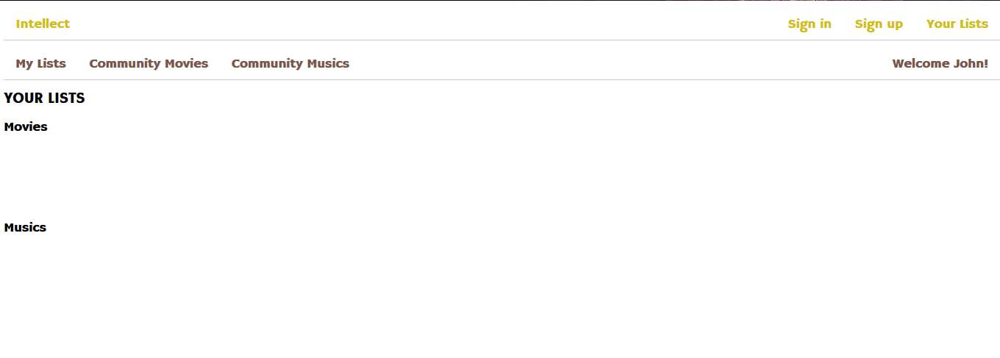

User Guide
==========

As a visitor of Intellect, you are welcomed with the homepage.

.. figure:: images/homepage.png
   :scale: 50 %
   :alt: Intellect homepage
      Intellect homepage

You should sign up to get full benefit of Intellect. For that, you should visit the sign up page.

.. figure:: signup.png
   :scale: 50 %
   :alt: Signup page
      Intellect signup page

With a successful sign-up you are redirected to the sign-in page.
.. figure:: signin.png
   :scale: 50 %
   :alt: Signin page
      Intellect signin page

After the sign-in now you can start using Intellect. Initially, your lists are empty as it is shown below.

      Intellect Mylists page

.. toctree::

Now it's time to visit the community movies/musics. Let's start with movies. Don't forget that the very similar operations
are applied for musics.
**#community movies (empty) **::

   .. figure:: picture.png
      :scale: 50 %
      :alt: map to buried treasure

      This is the caption of the figure (a simple paragraph).

.. toctree::

As an Intellect user, you are more than free to contribute the community movies.
Here you can add, update or delete the movies you wish.

Let's start by adding a movie.

**# add to community movies **::

   .. figure:: picture.png
      :scale: 50 %
      :alt: map to buried treasure

      This is the caption of the figure (a simple paragraph).

.. toctree::

We can add couple more, and update / delete.

**#operations on community movies**::

   .. figure:: picture.png
      :scale: 50 %
      :alt: map to buried treasure

      This is the caption of the figure (a simple paragraph).

.. toctree::
    member1