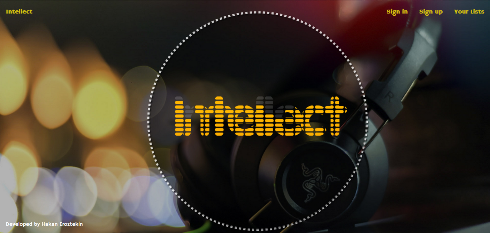

User Guide
==========

As a visitor of Intellect, you are welcomed with the homepage.

.. image:: homepage.png

**#add homepage**

Homepage
--------

 Explanation..

.. figure:: ../../images/homepage.png
   :scale: 50 %
   :alt: map to buried treasure

      This is the caption of the figure (a simple paragraph).

You should sign up to get full benefit of Intellect. For that, you should visit the sign up page.

**#add sign up**
   .. image:: images/homepage.png
   .. image:: docs/source/images/homepage.png

   .. figure:: static/image/homepage.png
      :scale: 50 %
      :alt: sign up

      This is the caption of the figure (a simple paragraph).

With a successful sign-up you are redirected to the sign-in page.
**#add sign in**::

   .. figure:: picture.png
      :scale: 50 %
      :alt: map to buried treasure

      This is the caption of the figure (a simple paragraph).

.. toctree::

After the sign-in now you can start using Intellect. Initially, your lists are empty as it is shown below.
**#add my lists (empty) **::

   .. figure:: picture.png
      :scale: 50 %
      :alt: map to buried treasure

      This is the caption of the figure (a simple paragraph).

.. toctree::

Now it's time to visit the community movies/musics. Let's start with movies. Don't forget that the very similar operations
are applied for musics.
**#community movies (empty) **::

   .. figure:: picture.png
      :scale: 50 %
      :alt: map to buried treasure

      This is the caption of the figure (a simple paragraph).

.. toctree::

As an Intellect user, you are more than free to contribute the community movies.
Here you can add, update or delete the movies you wish.

Let's start by adding a movie.

**# add to community movies **::

   .. figure:: picture.png
      :scale: 50 %
      :alt: map to buried treasure

      This is the caption of the figure (a simple paragraph).

.. toctree::

We can add couple more, and update / delete.

**#operations on community movies**::

   .. figure:: picture.png
      :scale: 50 %
      :alt: map to buried treasure

      This is the caption of the figure (a simple paragraph).

.. toctree::

   Hakan Eröztekin