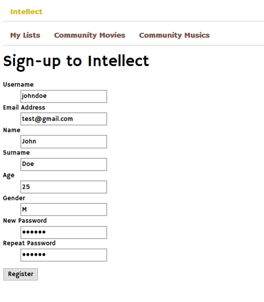
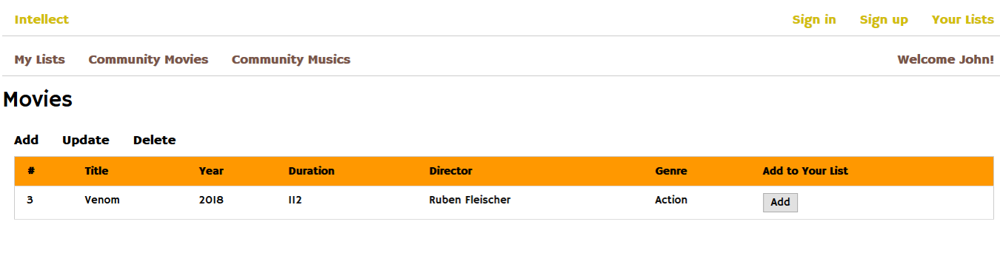
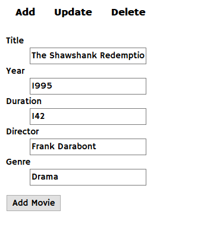

User Guide
==========

As a visitor of Intellect, you are welcomed with the homepage.

.. figure:: homepage.png
   :scale: 50 %
   :alt: Intellect homepage
      Intellect homepage

You should sign up to get full benefit of Intellect. For that, you should visit the sign up page.

      Intellect signup page

With a successful sign-up you are redirected to the sign-in page.

.. figure:: signin.png
   :scale: 50 %
   :alt: Signin page
      Intellect signin page

After the sign-in now you can start using Intellect. Initially, your lists are empty as it is shown below.

.. figure:: mylists-empty.png
   :scale: 50 %
   :alt: Mylists page
      Intellect Mylists page

Now it's time to visit the community movies/musics. Let's start with movies. Don't forget that the very similar operations
are applied for musics.

As an Intellect user, you are more than free to contribute the community movies.
Here you can add, update or delete the movies you wish.

Let's start by adding a movie.

.. figure:: movies-add.png
   :scale: 50 %
   :alt: Community Add Movies page
      Intellect Community Add Movies page

And here it is in the Community Movies,

      Intellect Community Movies page

We can add more movies,

      Intellect Community Add Movies page

Our community list is growing,

   .. figure:: community-movies2.png
      :scale: 50 %
      :alt: Community Movies page
      Community Movies page

.. toctree::
    member1